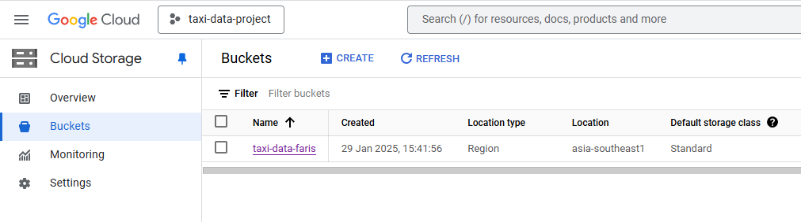

# Data Engineering Project Portfolio using Google Cloud Platform GCP

## Introduction
The goal of this project is being able to perform data engineering using GCP storage, Virtual Machine VM Instance, BigQuery and Mage AI Data Pipeline Tool and perform data analytics visualization on Looker Studio using data stored in BigQuery.

## Data Architecture

Data architecture basic from this project raw data are stored in Google Cloud Storage. Then, running Mage AI on VM instance the data is load, transform and then export to the BigQuery database. From BigQuery data is export to Looker Studio for analysis.

## Technolgy Used
Among the technology used for this project are as follows:
- Programming Languages:
1. Python
2. SQL
- Google Cloud Platform:
1. Google Storage
2. VM Instance
3. BigQuery
4. Looker Studio
- Data Pipeline Tool:
1. Mage AI

## Dataset Used
TLC Trip Record Data Yellow and green taxi trip records include fields capturing pick-up and drop-off dates/times, pick-up and drop-off locations, trip distances, itemized fares, rate types, payment types, and driver-reported passenger counts.

Link for dataset : https://www.nyc.gov/assets/tlc/downloads/pdf/data_dictionary_trip_records_yellow.pdf

## Data Model

Data Model is create using Lucid.app Link: https://lucid.app/documents/#/home?folder_id=recent

## Step by Step Guides
1. Firstly register Google Cloud Platform account.
2. Create a new GCP Project.
3. Upload your dataset into Google Cloud Storage under bucket section.

4. Create a VM Instance. Then click SSH to run the VM.

5. Once VM running, please run VM commands to install libraries inside the VM.
6. Then start Mage AI to create a data pipeline. Data Pipeline file are inside Mage Data Pipeline. Example of Data Pipeline are as below.

7. Transform data are export to BigQuery

8. SQL command is done to combine data into one table call Data Analytics.
9. Data is export to Looker Studio for analysis.

Link for Dashboard:https://lookerstudio.google.com/u/0/reporting/693d0b23-f69b-462b-866a-fc8313d33345/page/287iE

## Challenges
Among the challenges I had during this project are:
- My data pipeline keep crashing due to high usage of VM CPU. What I did was I reduced the dataset size. You can see the code inside https://github.com/yeopster/Data_Engineering_GCP/blob/main/Notebook%20File/Reduced_the_taxi_dataset.ipynb
- Second problem that during analysis I want to analyse the are with high number of pickup but the problem is the dataset only have latitude and longitude. So what I did is to convert the latitude and longitude into Area Name using code inside https://github.com/yeopster/Data_Engineering_GCP/blob/main/BigQuery%20SQL/Adding%20Pickup%20Zone.sql

## Conclusion
In conclusion, from this project I have gain knowledge to use some tools from Google Cloud Storage and also do data pipeline using Mage AI. I will able to use this knowledge to implement in real life situation and also industrial need.
